변동성이 관리된 포트폴리오의 한국시장에서의 실증 분석
================
Buyoun Lim
10/17/2017

``` r
library(tidyverse)
library(lubridate)
library(readxl)
library(broom)
library(tidyverse)
library(tseries)
library(xts)
library(corrplot)
library(grid)
library(gridExtra)
library(kableExtra)
```

``` r
# Functions


## get monthly return from daily return
get_monthly_return <- function(df) {
  monthly_ret <- df %>%
    group_by(date = ceiling_date(date, 'month') - days(1)) %>%
    summarize(ret = round(((prod(1+ret/100)-1)*100),2)) %>%
    filter(date <= '2017-09-30')
}

## get realized volatility
get_rv <- function(df) {
  grouped <- df %>%
    group_by(date = ceiling_date(ceiling_date(ymd(date), 'month'),'month')-days(1)) %>%
    summarize(rv = var(ret))
}

## get managed return
get_man_ret <- function(df) {
  df <- df %>% 
    mutate(man_ret = ret/rv)
  
  ret_vol <- var(df$ret)
  man_ret_vol <- var(df$man_ret)
  const <- (ret_vol/man_ret_vol)^(1/2)
  #print(const)
  
  df <- df %>%
    mutate(man_ret = const * man_ret)
  return(df)
}

#define function that returns mean-variance optimized portfolio daily returns

get_optimize <- function(factors, name, df) {
  #factors example : c('mkt', 'smb', 'hml')
  choice <- (df %>% 
    filter(factor %in% factors))$data %>%
    reduce(inner_join, by='date')
  weight <- (xts(choice[-1], order.by = choice[[1]]) %>%
               portfolio.optim())$pw
  returns <- map2(choice[-1], weight, `*`) %>% 
    pmap(sum) %>% 
    unlist()
  final_df <- tibble(
    date = choice$date,
    ret = returns,
    factor = name
  )
}
# regression for univariate
linear_model <- function(df) {
  lm(man_ret ~ ret, data = df)
}  

# regression for multifactor
ff3_model_1 <- function(df) {
  lm(man_ret ~
       (by_factor%>%filter(factor == 'mkt'))$ret_monthly[[1]]$ret +
       (by_factor%>%filter(factor == 'smb'))$ret_monthly[[1]]$ret +
       (by_factor%>%filter(factor == 'hml'))$ret_monthly[[1]]$ret, data = df)
}

ff3_model_2 <- function(df) {
  lm(man_ret ~ ret +  
       (by_factor%>%filter(factor == 'mkt'))$ret_monthly[[1]]$ret +
       (by_factor%>%filter(factor == 'smb'))$ret_monthly[[1]]$ret +
       (by_factor%>%filter(factor == 'hml'))$ret_monthly[[1]]$ret, data = df)
}

# regression for recession dummy 
linear_model_dummy_kor <- function(df) {
  lm(man_ret ~ ret + dummy_kor + dummy_kor_ret, data = df)
}  

linear_model_dummy_usa <- function(df) {by
  lm(man_ret ~ ret + dummy_usa + dummy_usa_ret, data = df)
}  

linear_model_dummy_inter <- function(df) {by
  lm(man_ret ~ ret + dummy_inter + dummy_inter_ret, data = df)
}  


# motivation plot
motiv_plot <- function(factor){
  monthly <- (by_factor %>%
    filter(factor == !!factor) %>%
    .$ret_monthly)[[1]] %>%
    arrange(rv)
  
  # mkt_monthly <- plot_vol %>%
  #   filter(factor=='mkt') %>%
  #   full_join(mkt_monthly, by='date') %>%
  #   filter(date > "1996-07-31", date < "2017-07-31") %>%
  #   arrange(vol) 
  
  chunk <- function(x,n) {
    split(x, cut(seq_along(x), n, labels = FALSE))
  }
  ret <- chunk(monthly$ret, 3)
  rec_dummy <- chunk(monthly$dummy_kor, 3)
  m <- unlist(map(ret, mean))
  v <- unlist(map(ret, var))
  rec_prob <- unlist(map(rec_dummy, ~sum(.)/length(.)))
  ratio <- unlist(map2(m, v, `/`))
  pl <- tibble(
    level = 1:length(m),
    mean = m,
    var = v,
    ratio = ratio,
    rec_prob = rec_prob)
  
  
  p1 <- ggplot(pl) + geom_col(aes(x=level, y= mean)) + theme(axis.title.y = element_blank()) + labs(x = "Average Return")
  p2 <- ggplot(pl) + geom_col(aes(x=level, y= var)) + theme(axis.title.y = element_blank()) + labs(x = "Variance")
  p3 <- ggplot(pl) + geom_col(aes(x=level, y= ratio)) + theme(axis.title.y = element_blank()) + labs(x = "E[R]/VAR[R]")
  p4 <- ggplot(pl) + geom_col(aes(x=level, y= rec_prob)) + theme(axis.title.y = element_blank()) + labs(x = "Probability of Recession")
  
  multiplot(p1, p2, p3, p4, layout = matrix(c(1,3,2,4), 2, 2))
}

# recession period plot
plot_vol_by_factor <- function(df, factor) {
  df <- (df %>% filter(factor==!!factor))$ret_monthly[[1]]
  ggplot(df) +
    geom_line(aes(x=date, y=rv)) +
    geom_rect(aes(xmin= ymd('1997-07-01'), xmax = ymd('1998-07-31'), ymin = -Inf, ymax = Inf), alpha = 0.006) +
    geom_rect(aes(xmin= ymd('2000-08-01'), xmax = ymd('2001-04-30'), ymin = -Inf, ymax = Inf), alpha = 0.006) +
    geom_rect(aes(xmin= ymd('2002-09-01'), xmax = ymd('2005-01-31'), ymin = -Inf, ymax = Inf), alpha = 0.006) +
    geom_rect(aes(xmin= ymd('2008-01-01'), xmax = ymd('2009-03-30'), ymin = -Inf, ymax = Inf), alpha = 0.006) +
    geom_rect(aes(xmin= ymd('2011-02-01'), xmax = ymd('2013-01-31'), ymin = -Inf, ymax = Inf), alpha = 0.006) +
    geom_rect(aes(xmin= ymd('2014-04-01'), xmax = ymd('2016-11-30'), ymin = -Inf, ymax = Inf), alpha = 0.006) +
    theme_classic()
}


# risk parity factor

get_rolling_inv_std <- function(df) {
  1/(df$ret %>% rollapply(width = 36, FUN=sd, fill = NA, align = 'right'))
}

col_bind_r_inv_std <- function(df, inv) {
  mutate(df, inv_std = inv) 
}

col_bind_man_ret <- function(df_rp, df_man) {
  mutate(df_rp, man_ret = df_man$man_ret,
         ret = df_man$ret)
}

get_inv_std_weight_vector <- function(df, factor){
  df_ <- inv_df %>%
    select(factor) 
  sums <- rowSums(df_)
  res <- as.tibble(df_/sums)
  res$date <- by_factor$ret_monthly[[1]]$date
  res <- res %>%
    gather(-date, key='factor', value='weight')
  return(res)
}

get_rv_ret <- function(factor, df, weight) {
  df <- df %>% 
    filter(factor %in% factor) %>%
    inner_join(weight, by=c('factor','date')) %>%
    mutate(rp_w_ret = ret * weight) %>%
    select(date, factor, rp_w_ret) %>%
    spread(key = factor, value = rp_w_ret) 
  df$rp_ret <- df %>% select(-date) %>% rowSums() 
  df <- df %>% select(date, rp_ret)
}

# regression for risk parity factor
linear_model_rp <- function(df) {
  lm(man_ret ~ ret + rp_ret, data=df)
}
```

``` r
# import data

fileNames <- Sys.glob("data/daily/factors/*.xlsx")

by_factor <- fileNames %>% 
  map(read_xlsx) %>%
  bind_rows() %>%
  mutate(date = ymd(date)) %>%
  group_by(factor) %>%
  nest() %>%
  mutate(ret_monthly = 
           map(data, get_monthly_return) %>%
           map2(map(data, get_rv), inner_join, by='date') %>%
           map(get_man_ret)
  )
```

``` r
recession_dummy <- by_factor$ret_monthly[[1]]['date']
recession_dummy <-
  recession_dummy %>%
  mutate(dummy_kor = if_else((date >= '1997-07-01' & date <= '1998-07-31' ) |
                           (date >= '2000-08-01' & date <= '2001-04-30') |
                           (date >= '2002-09-01' & date <= '2005-01-31') |
                           (date >= '2008-01-01' & date <= '2009-03-30') |
                           (date >= '2011-02-01' & date <= '2013-01-31') |
                           (date >= '2014-04-01' & date <= '2016-11-30'), 1, 0),
         dummy_usa = if_else((date >= '2001-03-01' & date <= '2001-11-30' ) |
                           (date >= '2007-12-01' & date <= '2009-06-30'), 1, 0),
         dummy_inter = if_else((date >= '2001-03-01' & date <= '2001-04-30' ) |
                           (date >= '2008-01-01' & date <= '2009-02-28'), 1, 0)
         )

rec1 <- recession_dummy$date >= '1997-07-01' & recession_dummy$date <= '1998-07-31' #imf
rec2 <- recession_dummy$date >= '2000-08-01' & recession_dummy$date <= '2001-04-30'
rec3 <- recession_dummy$date >= '2002-09-01' & recession_dummy$date <= '2005-01-31'
rec4 <- recession_dummy$date >= '2008-01-01' & recession_dummy$date <= '2009-03-30'
rec5 <- recession_dummy$date >= '2011-02-01' & recession_dummy$date <= '2013-01-31'
rec6 <- recession_dummy$date >= '2014-04-01' & recession_dummy$date <= '2016-11-30'

rec1_usa <- recession_dummy$date >= '2001-03-01' & recession_dummy$date <= '2001-11-30'
rec2_usa <- recession_dummy$date >= '2007-12-01' & recession_dummy$date <= '2009-06-30'

by_factor$ret_monthly <- by_factor$ret_monthly %>%
  map(mutate,
      dummy_kor = recession_dummy$dummy_kor,
      dummy_usa = recession_dummy$dummy_usa,
      dummy_kor_ret = ret * dummy_kor,
      dummy_usa_ret = ret * dummy_usa,
      dummy_inter = recession_dummy$dummy_inter,
      dummy_inter_ret = ret * dummy_inter)
```

Motivation
==========

평균-분산 투자자는, $\\frac{\\mu\_t}{{\\sigma^2\_t}}$의 크기에 비례하여 위험자산의 비중을 결정한다. 1996년 8월부터 2017년 6월까지 포트폴리오의 월간 수익률을, 해당월의 바로 전 달의 일간 수익률의 분산의 크기 순서대로 정렬을 한 후, 3개의 그룹으로 나눈다. 각 그룹의 평균, 분산, 평균/분산 비율과 해당 월이 경기후퇴(recession) 시기일 확률을 구한다. 포트폴리오는 파마 프렌치 5개 요인 (시장(mkt), 규모(smb), 가치(hml), 투자(cma), 수익(rmw))과 단기추세(mom)를 이용한다.

MKT

``` r
motiv_plot('mkt')
```

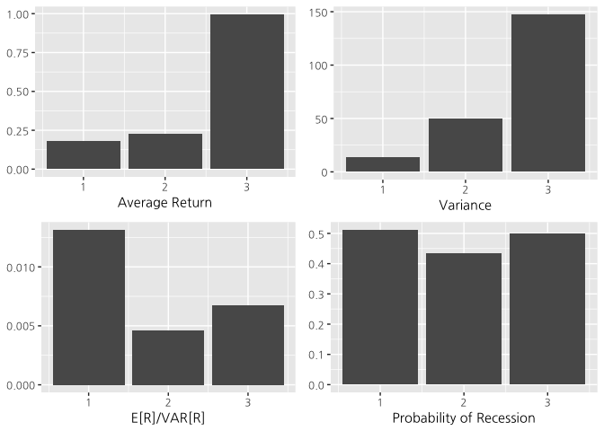

SMB

``` r
motiv_plot('smb')
```

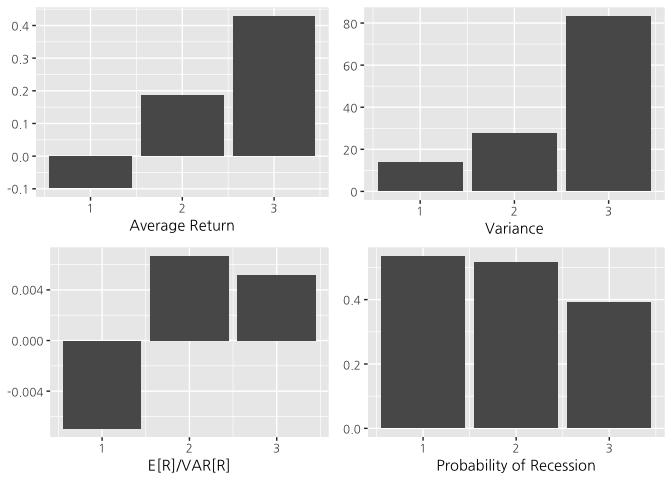

HML

``` r
motiv_plot('hml')
```

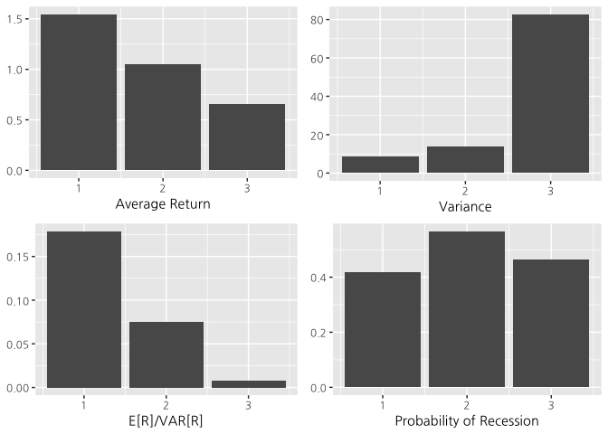

CMA

``` r
motiv_plot('cma')
```

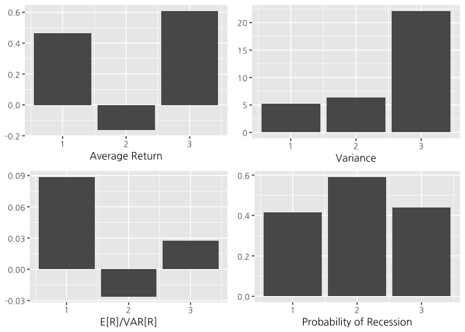

RMW

``` r
motiv_plot('rmw')
```

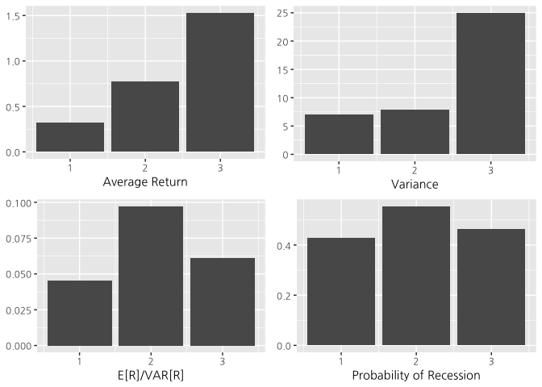

MOM

``` r
motiv_plot('mom')
```

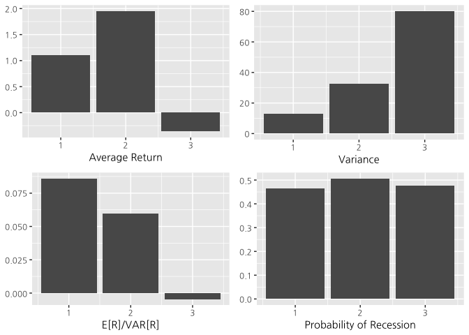

모든 요인이 전달 일간수익률의 분산이 큰 그룹일수록 해당 월의 월간수익률의 분산이 큰 패턴을 보이고 있다. 하지만 해당 월의 월간수익률의 평균수익률은 일정한 패턴을 찾아보기 힘들다. 즉, 해당월의 월간수익률의 분산은 전 달의 일간수익률의 분산으로 어느정도 프록시가 가능하지만, 해당월의 평균수익률과는 상관관계를 찾아보기 힘들다. 따라서, 평균/분산 비율을 구할때, 분산을 전 달의 일간수익률로 프록시를 하고, 평균은 일정하다고 가정을 해서 위험자산에 투자하는 비중을 결정하면 될 것이다. 즉, 평균-분산 투자자라면 전달 일간수익률의 분산의 크기가 작을수록 위험자산에 대한 비중을 늘릴것이다. 또한, 대체적으로 전 달의 일간수익률이 큰 그룹일수록 경기후퇴 시기일 확률이 높다. 따라서, 위와 같은 전략을 구사하면 경기후퇴 시기일때 위험자산에 대한 비중을 줄일것이다.

Data
====

FN-DataGuide에서 KOSPI와 KOSDAQ에 상장된 기업들의 수정주가와 재무 데이터, 통화안정증권 연간 수익률을 가져왔다. 금융 기업, 자본잠식기업, 12월말 결산이 아닌 기업들은 제거하였다. Fama (2015)에 있는 방법을 통해 시장, 규모, 가치, 투자, 수익, 단기추세 요인을 만들었다. 많은 기업들을 포트폴리오에 포함시키기 위해 KOSDAQ 시장에 상장된 기업들을 가져왔다. 이 기업들은 1996년에 상장되었기 때문에, 1996년 8월부터 2017년 6월까지의 데이터를 이용했다.

한국의 경기후퇴 시기에 대한 자료는 [OECD based Recession Indicator](https://fred.stlouisfed.org/series/KORRECD/) 에서 가져왔으며, 해당 시기는 다음과 같다.

-   1997년 7월 1일 ~ 1998년 7월 31일
-   2000년 8월 1일 ~ 2001년 4월 30일
-   2002년 9월 1일 ~ 2005년 1월 31일
-   2008년 1월 1일 ~ 2009년 3월 30일
-   2011년 2월 1일 ~ 2013년 1월 31일
-   2014년 4월 1일 ~ 2016년 11월 30일

Analysis
========

위 Motivation을 바탕으로, 포트폴리오를 구성해보자. 어떤 포트폴리오  *f* 가 있을때, *f*<sup>*σ*</sup>을 *변동성이 관리된 포트폴리오* 라고 한다.

$$f\_{t+1}^\\sigma = \\frac{c}{\\hat{\\sigma}^2\_t(f\_{t+1})}f\_{t+1}$$

-   *f*<sup>*t* + 1</sup> : 포트폴리오의 *t* + 1 기간의 월간 수익률
-   $\\hat{\\sigma}^2\_t(f\_{t+1})$ : 포트폴리오의 *t* + 1 기간의 월간 수익률의 분산
-   *c* : *f*와 *f*<sup>*σ*</sup>의 분산을 같게 해주는 상수

$\\hat{\\sigma}^2\_t(f\_{t+1})$는 다음과 같이 추정 한다.
$$\\hat{\\sigma}^2\_t(f\_{t+1})=Var(f\_{t,d})$$

-   *f*<sub>*t*, *d*</sub> : 포트폴리오 *f*의 *t* 기간의 실현된 일간수익률

시장(mkt), 규모(smb), 가치(hml), 투자(inv), 수익(rmw), 단기추세(mom) 요인들이 자산의 가격정보를 담고 있다고 알려져 있다. 각 요인마다의 상관계수를 구해보면 다음과 같다.

``` r
ret_cor <- map(by_factor$ret_monthly, select, ret) %>% 
  bind_cols() 
colnames(ret_cor) <- c('cma', 'hml', 'mkt', 'mom', 'rmw', 'smb')
ret_cor %>% 
  cor() %>%
  corrplot.mixed(lower = 'number', upper = 'pie') 
```

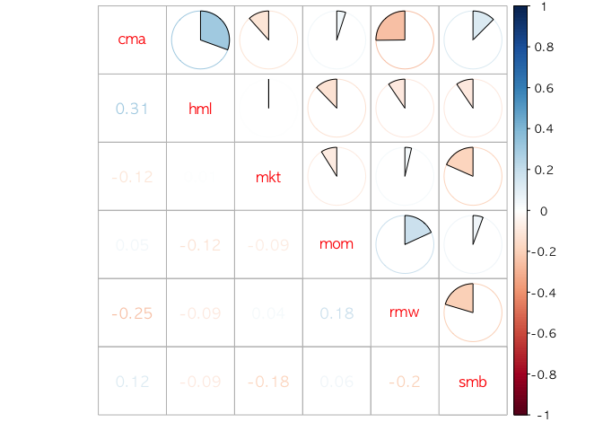

상관계수의 절대값이 갖아 큰 값은 0.31 이다. 만약 이 값이 작다고 여겨진다면, 각각의 요인들은 다른 차원의 위험을 담고 있다고 할수 있다.

Univariate regression
---------------------

이 각각의 요인들을 바탕으로, 다음과 같은 회귀분석을 한다.

*f*<sub>*t* + 1</sub><sup>*σ*</sup> = *α* + *β**f*<sub>*t* + 1</sub> + *ϵ*<sub>*t* + 1</sub>

여기서 /*a**l**p**h**a*가 0보다 유의하게 크다면, 변동성 관리 전략의 샤프 비율이 기존 포토폴리오의 샤프 비율 보다 크다. 즉,
$$SR\_{new} =  \\sqrt{SR^2\_{old}+(\\frac{\\alpha}{\\sigma\_\\epsilon})^2}$$

-   *S**R*<sub>*n**e**w*</sub> : 변동성이 관리된 포트폴리오의 샤프 비율
-   *S**R*<sub>*o**l**d*</sub> : 기존 포트폴리오의 샤프 비율
-   *S**R*<sub>*n**e**w*</sub> : 잔차의 분산

회귀분석 결과 다음과 같다.

``` r
by_factor <- by_factor %>%
  mutate(linear_model = map(ret_monthly, linear_model),
         ff3_model = if_else((factor %in% c('mkt', 'smb', 'hml')),
                             map(ret_monthly, ff3_model_1),
                             map(ret_monthly, ff3_model_2))
         )
```

``` r
coeff_linear <- by_factor %>%
  mutate(linear = map(linear_model, tidy)) %>%
  unnest(linear, .drop=TRUE)

coeff_ff3 <- by_factor %>%
  mutate(ff3 = map(ff3_model, tidy)) %>%
  unnest(ff3, .drop=TRUE)


glance_linear <- by_factor %>%
  mutate(glance_linear = map(linear_model, glance)) %>%
  unnest(glance_linear, .drop=TRUE)

glance_ff3 <- by_factor %>%
  mutate(glance_ff3 = map(ff3_model, glance)) %>%
  unnest(glance_ff3, .drop=TRUE)

coeff_linear %>% filter(term=='(Intercept)')
```

    ## # A tibble: 6 x 6
    ##   factor        term    estimate std.error  statistic      p.value
    ##    <chr>       <chr>       <dbl>     <dbl>      <dbl>        <dbl>
    ## 1    cma (Intercept)  0.18412497 0.1496799  1.2301252 2.198111e-01
    ## 2    hml (Intercept)  1.47197626 0.3051135  4.8243557 2.449430e-06
    ## 3    mkt (Intercept)  0.16906173 0.4208723  0.4016936 6.882541e-01
    ## 4    mom (Intercept)  1.03573716 0.3220216  3.2163593 1.470212e-03
    ## 5    rmw (Intercept) -0.04279967 0.1675788 -0.2554003 7.986248e-01
    ## 6    smb (Intercept)  0.06783631 0.3109135  0.2181839 8.274645e-01

``` r
coeff_ff3 %>% filter(term=='(Intercept)')
```

    ## # A tibble: 6 x 6
    ##   factor        term    estimate std.error  statistic      p.value
    ##    <chr>       <chr>       <dbl>     <dbl>      <dbl>        <dbl>
    ## 1    cma (Intercept)  0.24002668 0.1509296  1.5903222 1.130465e-01
    ## 2    hml (Intercept)  1.48341304 0.3056649  4.8530704 2.155859e-06
    ## 3    mkt (Intercept)  0.07177665 0.4288626  0.1673651 8.672197e-01
    ## 4    mom (Intercept)  0.95965172 0.3287121  2.9194292 3.831952e-03
    ## 5    rmw (Intercept) -0.09119645 0.1678141 -0.5434372 5.873209e-01
    ## 6    smb (Intercept)  0.11568574 0.3173423  0.3645456 7.157625e-01

변동성이 관리된 HML, MOM 팩터가 파마프렌치 3 팩터를 컨트롤 해준 후에도 유의하게 알파가 0보다 큼을 알수있다.

Multifactor regression
----------------------

다음으로 다중요인 포트폴리오를 만들어서 회귀분석을 해보자. *F*<sub>*t* + 1</sub>을 요인 수익률의 벡터라고 하자. 요인을 조합하여 포트폴리오 *f*<sub>*t* + 1</sub><sup>*M**V**E*</sup>를 만드는데, 포트폴리오가 효율적인 평균-분산이 되도록 비중 벡터 *b*를 정한다. 즉,

*f*<sub>*t* + 1</sub><sup>*M**V**E*</sup> = *b*<sup>′</sup>*F*<sub>*t* + 1</sub>

변동성이 관리된 포트폴리오 *f*<sub>*t* + 1</sub><sup>*M**V**E*, *σ*</sup>를 다음과 같이 정의하자.

$$f^{MVE,\\sigma}\_{t+1} = \\frac{c}{\\hat{\\sigma}^2\_t(f^{MVE}\_{t+1})}f^{MVE}\_{t+1}$$

Univariate factor의 경우와 같이 회귀분석을 해보면

``` r
factors <- list(
  ff3 = c('mkt','smb','hml'),
  ff3_mom = c('mkt','smb','hml','mom'),
  ff5 = c('mkt','smb','hml','cma','rmw'),
  ff5_mom = c('mkt','smb','hml','cma','rmw','mom')
)

by_multi <- map2(factors, names(factors), get_optimize, df = by_factor) %>%
  bind_rows() %>%
  mutate(date = ymd(date)) %>%
  group_by(factor) %>%
  nest() %>%
  mutate(ret_monthly = 
           map(data, get_monthly_return) %>%
           map2(map(data, get_rv), inner_join, by='date') %>%
           map(get_man_ret)
  )
```

``` r
#linear model for multi factor
by_multi<- by_multi %>%
  mutate(linear_model = map(ret_monthly, linear_model))
```

``` r
coeff_linear_multi <- by_multi %>%
  mutate(linear = map(linear_model, tidy)) %>%
  unnest(linear, .drop=TRUE)


glance_linear_multi <- by_multi %>%
  mutate(glance_linear = map(linear_model, glance)) %>%
  unnest(glance_linear, .drop=TRUE)

coeff_linear_multi %>% filter(!term=='ret')
```

    ## # A tibble: 4 x 6
    ##    factor        term  estimate std.error statistic      p.value
    ##     <chr>       <chr>     <dbl>     <dbl>     <dbl>        <dbl>
    ## 1     ff3 (Intercept) 0.4195097 0.1810388  2.317236 2.130256e-02
    ## 2 ff3_mom (Intercept) 0.4668893 0.1484246  3.145633 1.858737e-03
    ## 3     ff5 (Intercept) 0.4157004 0.1033324  4.022945 7.626992e-05
    ## 4 ff5_mom (Intercept) 0.4425099 0.1054008  4.198355 3.745237e-05

Recession period
----------------

변동성을 관리하는 전략이, 경기후퇴 기간에 위험자산에 비중을 줄이는지 다음의 회귀분석을 통해 살펴보자.

*f*<sub>*t*</sub><sup>*σ*</sup> = *α*<sub>0</sub> + *α*<sub>1</sub>1<sub>*r**e**c*, *t*</sub> + *β*<sub>0</sub>*f*<sub>*t*</sub> + *β*<sub>1</sub>1<sub>*r**e**c*, *t*</sub> × *f*<sub>*t*</sub> + *ϵ*<sub>*t*</sub>

``` r
recession_dummy <- by_factor$ret_monthly[[1]]['date']
recession_dummy <-
  recession_dummy %>%
  mutate(dummy_kor = if_else((date >= '1997-07-01' & date <= '1998-07-31' ) |
                           (date >= '2000-08-01' & date <= '2001-04-30') |
                           (date >= '2002-09-01' & date <= '2005-01-31') |
                           (date >= '2008-01-01' & date <= '2009-03-30') |
                           (date >= '2011-02-01' & date <= '2013-01-31') |
                           (date >= '2014-04-01' & date <= '2016-11-30'), 1, 0),
         dummy_usa = if_else((date >= '2001-03-01' & date <= '2001-11-30' ) |
                           (date >= '2007-12-01' & date <= '2009-06-30'), 1, 0),
         dummy_inter = if_else((date >= '2001-03-01' & date <= '2001-04-30' ) |
                           (date >= '2008-01-01' & date <= '2009-02-28'), 1, 0)
         )

rec1 <- recession_dummy$date >= '1997-07-01' & recession_dummy$date <= '1998-07-31' #imf
rec2 <- recession_dummy$date >= '2000-08-01' & recession_dummy$date <= '2001-04-30'
rec3 <- recession_dummy$date >= '2002-09-01' & recession_dummy$date <= '2005-01-31'
rec4 <- recession_dummy$date >= '2008-01-01' & recession_dummy$date <= '2009-03-30'
rec5 <- recession_dummy$date >= '2011-02-01' & recession_dummy$date <= '2013-01-31'
rec6 <- recession_dummy$date >= '2014-04-01' & recession_dummy$date <= '2016-11-30'

rec1_usa <- recession_dummy$date >= '2001-03-01' & recession_dummy$date <= '2001-11-30'
rec2_usa <- recession_dummy$date >= '2007-12-01' & recession_dummy$date <= '2009-06-30'

by_factor$ret_monthly <- by_factor$ret_monthly %>%
  map(mutate,
      dummy_kor = recession_dummy$dummy_kor,
      dummy_usa = recession_dummy$dummy_usa,
      dummy_kor_ret = ret * dummy_kor,
      dummy_usa_ret = ret * dummy_usa,
      dummy_inter = recession_dummy$dummy_inter,
      dummy_inter_ret = ret * dummy_inter)
```

``` r
by_dummy<- by_factor %>%
  mutate(linear_dummy_model_kor = map(by_factor$ret_monthly, linear_model_dummy_kor),
         linear_dummy_model_usa = map(by_factor$ret_monthly, linear_model_dummy_usa),
         linear_dummy_model_inter = map(by_factor$ret_monthly, linear_model_dummy_inter)
         )
```

``` r
coeff_linear_dummy <- by_dummy %>%
  mutate(linear_kor = map(linear_dummy_model_kor, tidy)) %>%
  unnest(linear_kor, .drop=TRUE) 
  
glance_linear_dummy <- by_dummy %>%
  mutate(glance_linear = map(linear_dummy_model_kor, glance)) %>%
  unnest(glance_linear, .drop=TRUE)

coeff_linear_dummy %>% filter(term=='(Intercept)')
```

    ## # A tibble: 6 x 6
    ##   factor        term    estimate std.error  statistic      p.value
    ##    <chr>       <chr>       <dbl>     <dbl>      <dbl>        <dbl>
    ## 1    cma (Intercept)  0.25295203 0.2029788  1.2461992 2.138719e-01
    ## 2    hml (Intercept)  1.92428897 0.4115644  4.6755482 4.826740e-06
    ## 3    mkt (Intercept)  0.67548452 0.5959355  1.1334859 2.581092e-01
    ## 4    mom (Intercept)  1.39084641 0.4466049  3.1142658 2.061556e-03
    ## 5    rmw (Intercept) -0.24027525 0.2309821 -1.0402330 2.992488e-01
    ## 6    smb (Intercept) -0.07148961 0.4258715 -0.1678666 8.668256e-01

미국 시장과는 다르게 *β*<sub>1</sub>1<sub>*r**e**c*, *t*</sub>의 값이 모두 유의하지 않게 0보다 작게 나오지 않았다.

그럼 recession때 위험자산의 비중을 줄인다고 하는데, 그럼 정말 recession때는 평소보다 volatility가 큰가? 팩터별로 살펴보자.

MKT

``` r
plot_vol_by_factor(by_factor, 'mkt')
```

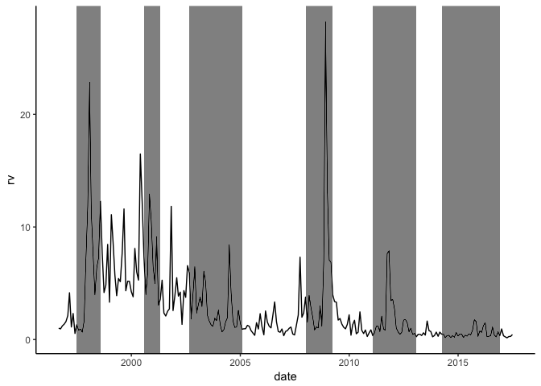

SMB

``` r
plot_vol_by_factor(by_factor, 'smb')
```

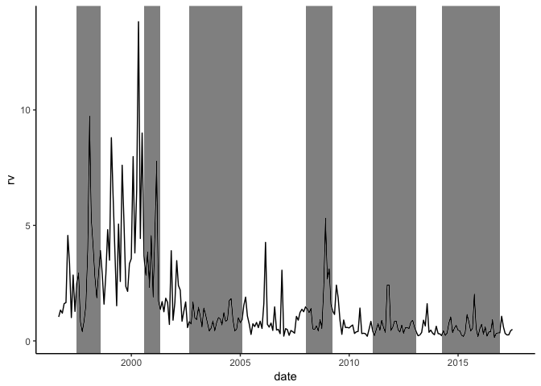

HML

``` r
plot_vol_by_factor(by_factor, 'hml')
```

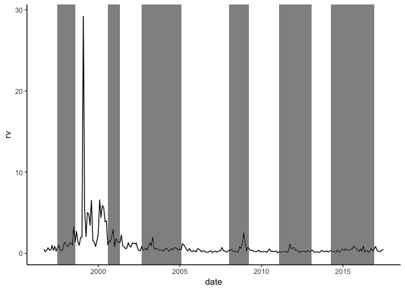

CMA

``` r
plot_vol_by_factor(by_factor, 'cma')
```

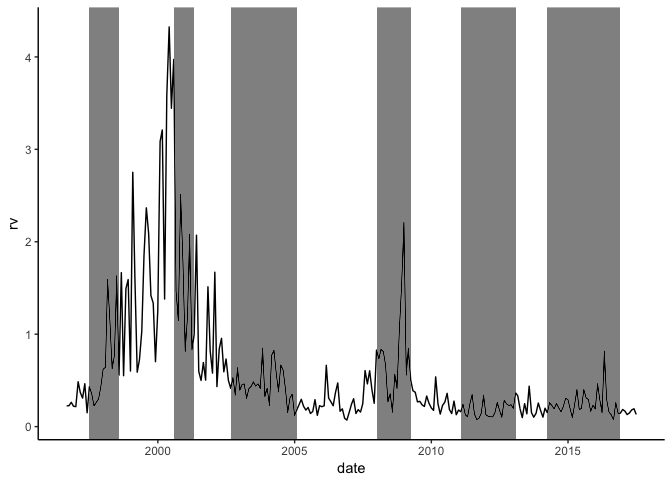

RMW

``` r
plot_vol_by_factor(by_factor, 'rmw')
```

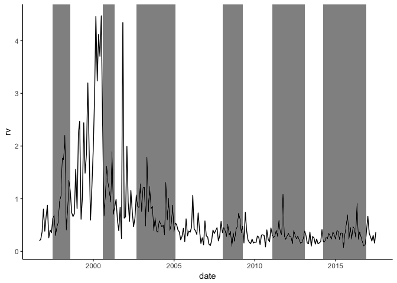

MOM

``` r
plot_vol_by_factor(by_factor, 'mom')
```

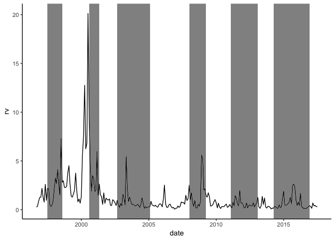

대체적으로 마켓 팩터는 recession period에 변동성이 큰데, 다른 팩터들은 recesssion period가 아닌 기간에도 변동성이 큰 부분이 많이 존재한다.

Multi factor regression controlling risk parity factor
------------------------------------------------------

Risk Parity (RP) 팩터는 다음과 같이 정의된다.

*R**P*<sub>*t* + 1</sub> = *b*<sub>*t*</sub><sup>′</sup>*f*<sub>*t* + 1</sub>

$$ b\_{i,t} = \\frac{1/\\tilde{\\sigma\_t}^i}{\\sum\_{i} 1/\\tilde{\\sigma\_t}^i}$$

얼핏 보면 변동성이 관리된 전략이 Risk Parity 전략과 비슷해 보일수 있다. 하지만 변동성이 관리된 전략은 팩터간 비중의 비율이 일정하지만, RP 전략의 팩터간 비중의 비율은 시간에 따라 항상 변한다.

위의 multifactor 회귀분석에서 RP팩터도 설명요인에 추가를 시켜 회귀분석을 해보자. 만약 여전히 알파가 0보다 유의하게 크다면, 두 전략은 다른 전략 이라는 것이 입증된다.

``` r
inv <- map(by_factor$ret_monthly, get_rolling_inv_std)
by_factor$ret_monthly <- map2(by_factor$ret_monthly, inv, col_bind_r_inv_std)
names(inv) <- by_factor$factor
inv_df <- as.tibble(inv)
```

``` r
rp_weight <- map(factors, get_inv_std_weight_vector, df=inv_df)
```

``` r
df_ <- by_factor %>% select(factor, ret_monthly) %>% unnest()

by_rp <- tibble(
  factor = by_multi$factor,
  rp_ret = map2(factors, rp_weight, get_rv_ret, df=df_)
  )

by_rp$rp_ret <- map2(by_rp$rp_ret, by_multi$ret_monthly, col_bind_man_ret)
by_rp$rp_ret <- map(by_rp$rp_ret, drop_na)
```

``` r
by_rp$linear_model <- map(by_rp$rp_ret, linear_model_rp)
coeff_linear_rp <- by_rp %>%
  mutate(linear_rp = map(linear_model, tidy)) %>%
  unnest(linear_rp, .drop=TRUE) 

coeff_linear_rp %>% filter(term=='(Intercept)')
```

    ## # A tibble: 4 x 6
    ##    factor        term  estimate std.error statistic      p.value
    ##     <chr>       <chr>     <dbl>     <dbl>     <dbl>        <dbl>
    ## 1     ff3 (Intercept) 0.3475741 0.1891541  1.837519 0.0675263951
    ## 2 ff3_mom (Intercept) 0.4657209 0.1622237  2.870856 0.0045067249
    ## 3     ff5 (Intercept) 0.3583038 0.1184222  3.025646 0.0027863749
    ## 4 ff5_mom (Intercept) 0.4200842 0.1211930  3.466242 0.0006382687

RP 팩터를 컨트롤링 해도, 대체적으로 알파가 유의하게 나옴을 볼수 있다.
